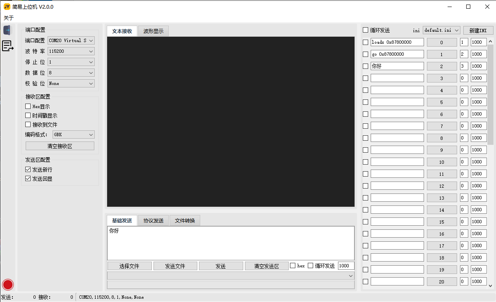

# 简易QT上位机 V2

在V1的基础上，我更新了更新的布局，优化部分体验，重构了代码，使得能更好的开发后续功能。具体的使用说明可以看文档。在  /使用文档/简易上位机使用说明书.docx   目录下。欢迎大家使用以及提意见。

后面暂时不更新该说明文档了，文档是 V2.0.0 的说明，可以简单看一下，后续的更新先在 readme 中的版本更新说明记录。release中还是会放置每次更新的软件。

# 版本更新说明

**V2.0.5：**

- 1、基础发送会保存历史选择文件。
- 2、增加 Ymodem 协议传输发送。

**V2.0.4：**

- 1、解决上版本修改IOSetting布局带来的无法保存配置的问题。
- 2、优化插拔串口的时候处理。

**V2.0.3：**

- 1、终端内增加输入法输入的功能，支持输入中文。但是有bug，不能左右中间增加。
- 2、解决插拔串口时，选框不能直接断开，或者插入新的串口时，会刷新combobox的问题。
- 3、修改了IOSetting的布局，感觉在左边太占位置了，放到了上面，然后把一些接收配置，放到了接收框中。
- 4、优化了接收框的选中文本复制效果。优化了终端输入的效果。

**V2.0.2：**

- 1、修复上版本终端光标问题，鼠标左键不能改变接收文本框的光标位置，右键可复制粘贴，可复制文本框选中文本。

**V2.0.1：**

- 1、单独封装了协议发送Xmodem。
- 2、终端可以实现上下左右的功能。
- 3、关闭打开界面大小等会保持上一次的状态。
- 4、修复部分循环发送时的Bug。
- 5、目前的问题是终端的光标问题，如果鼠标点击光标某个位置后，光标会移动到该位置，然后就会从光标位置开始增加数据，就会导致看着很乱。

**V2.0.0：**

- 1、基本功能完成。