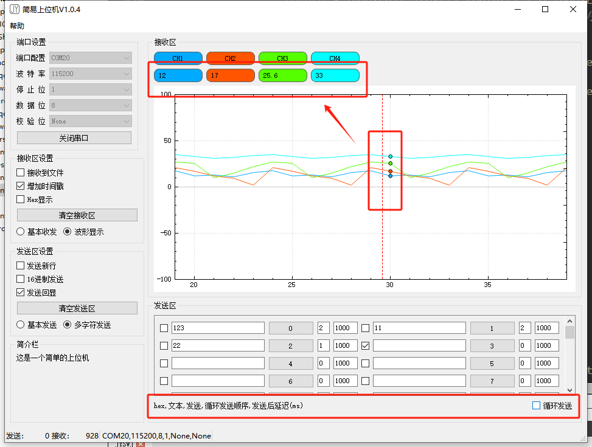
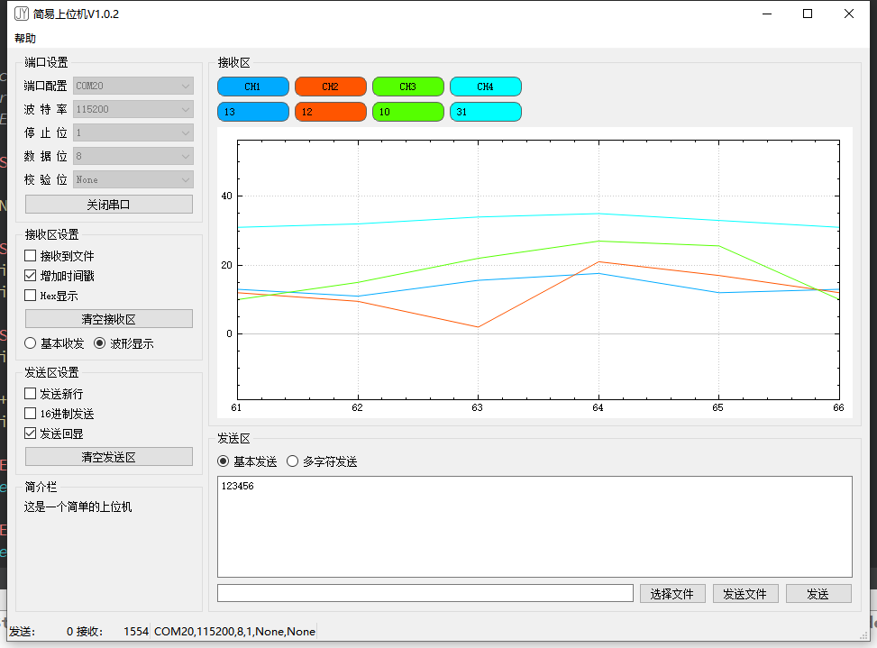

# 更新日志

2025-10-08：更新版本到V1.0.9

1、优化接收区的终端显示，新写了基于QPlainTextEdit的自建类，将接收文本框提升为自建类。

2、UTF和GBK接受区编码初步实现。

2025-10-08：更新版本到V1.0.8

1、修复Xmode协议发送较大文件时出现的问题。

2、UTF和GBK中文编码暂时还有问题，未想到处理办法。

2025-09-24：更新版本到V1.0.7

1、修改Xmode协议发送的CRC校验。

2、修改接收框能输入。

2025-08-31：更新版本到V1.0.6

1、更新循环发送的代码逻辑问题。适配了网络模式下的循环发送。

2、修复无法中文显示的问题。

2025-08-31：更新版本到V1.0.5

1、波形显示增加到8个通道，文件发送逻辑修改，并增加发送文件的进度条。波形显示关闭按钮使用C++代码生成，没有使用UI控件拖拽。

2、大布局修改成分裂器，然后左右两个widget，分别放的是原来的那两个垂直分布布局。

3、优化波形数据接收处的处理，上传数据格式为：$WAVE,12,17,25.6,33*12\r\n 不要超过8个数。

4、增加协议文件发送，目前可发送Xmodem协议的数据。

2025-08-16：更新版本到V1.0.4，波形显示增加竖线可以查看某一帧的数据，增加循环发送的功能，多字符循环发送顺序从小到大依次发送，为0的不发送，同等级的按照先后顺序发送。

2025-08-16：更新版本到V1.0.3，增加了数据波形显示，使用的是QCustomPlot的波形显示，上面的**通道可点击**决定波形是否显示，收发和波形显示的选择按钮移到了左边，波形显示可以缩放，在x轴上、在y轴上，或者在图像中间，关闭串口停下来后还可自由拖拽。

上传数据格式为：$WAVE,12,17,25.6,33*12\r\n

中间的4个数字就是显示的值，*后面理论上是校验，但是我现在这版本还没处理，所以你传什么都可以。

2025-08-06：更新版本到V1.0.2，增加了网络通信相关的内容，包含UDP通信、TCP服务端客户端通信。

2025-07-27：更新版本到V1.0.1，想了一下，觉得本来就无多少东西的界面内容合并到了一起，把串口和IO操作抽象出来。方便形成模块。同时tabwidget改成了stackwidget，后续更新方向为增加网络通信以及增加波形显示的内容。

# 简易QT上位机

这是一个简易的QT上位机，（伪简易），哈哈，为学习一些东西故意复杂化了一些东西。这是初始，后续会持续更新。我学到点新的就往里面加。

