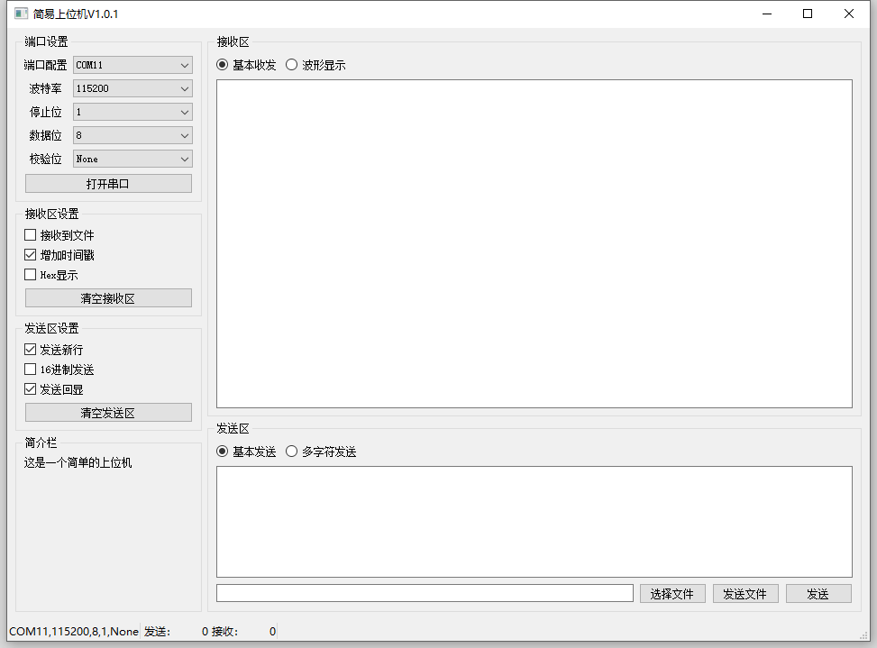
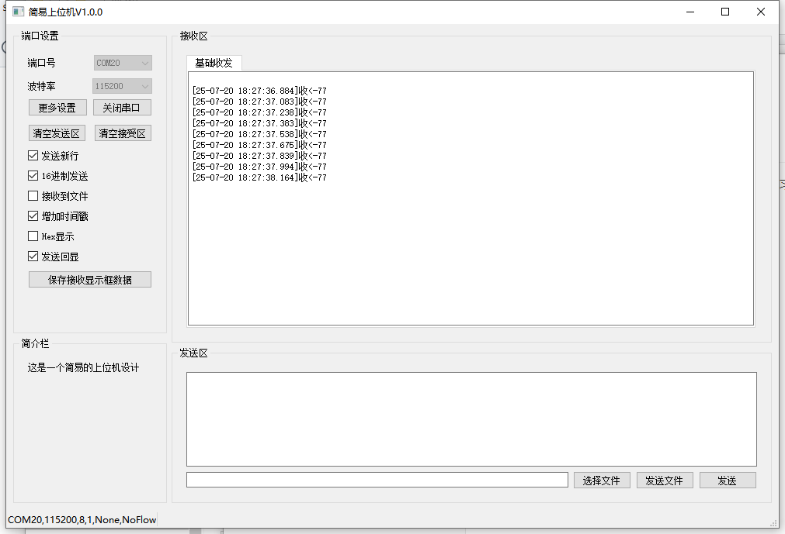

# 更新日志

2025-08-06：更新版本到V1.0.2，增加了网络通信相关的内容，包含UDP通信、TCP服务端客户端通信。

2025-07-27：更新版本到V1.0.1，想了一下，觉得本来就无多少东西的界面内容合并到了一起，把串口和IO操作抽象出来。方便形成模块。同时tabwidget改成了stackwidget，后续更新方向为增加网络通信以及增加波形显示的内容。

# 简易QT上位机

这是一个简易的QT上位机，（伪简易），哈哈，为学习一些东西故意复杂化了一些东西。这是初始，后续会持续更新。我学到点新的就往里面加。

