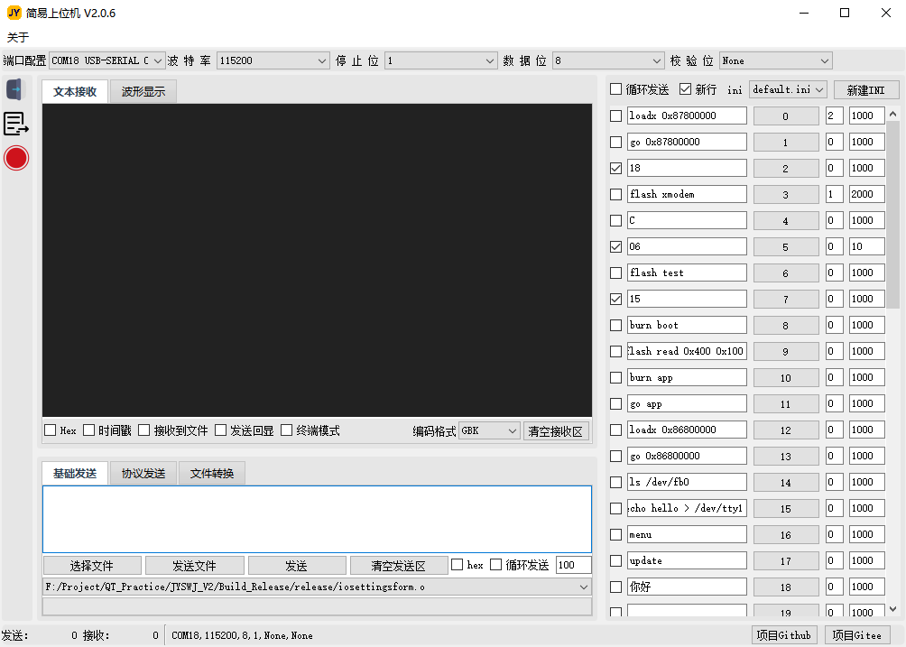

# JYSWJ —— 基于 Qt 的简易上位机 / 调试工具

> 一个轻量、模块化的 Qt 上位机软件，支持串口／网络通信、X/Y-Modem 协议、简单仿终端调试与数据波形显示，适用于设备调试、通信测试、协议调试等场景。

## ✨ 功能亮点

- 同时支持 **串口 (Serial)** 与 **网络 (TCP / UDP)** 通信 。
- 发送部分的文件发送选择支持**5条历史记录**，且能通过**右键删除选中记录**。
- 支持 **X-Modem / Y-Modem 协议**，方便设备固件传输 / 数据帧传输 。
- 支持 **IMX6ULL.bin**文件**添加头部文件**，使用的配置是正点原子的 **imxdownload** 配置。
- 内建 **仿终端 (Terminal) 窗口**，文本接收框支持类终端输入，方便调试板子的命令行，可通过**终端选框打开**。
- 支持 **实时 / 简易波形 / 数据显示**，波形显示支持8个通道数据波形。协议使用`$WAVE,13,12,10,31,44*12\r\n`即可，最多支持8个数据。
- 多字符发送支持**ini文件的快速建立和切换**，ini文件保存在目录 `Config/多字符配置文件` 下。

## ⚠️常见问题

- 终端模式不要接收带大量 0x08 的数据。这种情况建议使用普通的模式，关闭终端选框
- 网络连接如果开了VPN可能会导致网络连接失败。

## 📂 项目结构

```
JYSWJ/
├── CommonTools/          # 一些工具，比如文件转换
├── CommonWidget/         # 重写的界面，比如终端、自定义的ComboBox
├── DeviceIOService/      # 通信模块 (串口、网络)组件   
├── GraphShow/            # 绘图组件  
├── ProtocolTransfer/     # 协议传输组件   
├── RingBuffer/           # 循环缓冲组件 
├── mainwindow.cpp        # 主界面 
├── multisendform.cpp     # 多字符发送界面
├── recvareaform.cpp      # 接收界面
├── sendareaform.cpp      # 发送界面
├── stateform.cpp         # 状态栏界面
├── toolbarform.cpp       # 左侧工具栏界面
├── README.md             # 本说明文件  
└── ...                   # 其他 (LICENSE, .gitignore 等)  
```

## ⚙️ 构建 & 运行环境 & 软件使用

- **Qt 版本**：Qt5.12.12  
- **编译方式**：使用 QtCreator 的 MinGW-32bit 环境编译
- **软件使用**：如果只是想使用软件，可以直接在**release**中下载最新的软件包，直接使用即可。

## 📄 协议 & 通信规范

### 波形显示协议

波形显示使用字符串解析，所以你需要发送 `$WAVE,13,12,10,31,44*12\r\n` 这样的字符串就可以了。

WAVE开头代表这是一帧波形数据，后面的数字紧接着就是每个通道显示的值，支持小数，最多支持8个数，以`*`结尾，`*`后面的是校验符，但是校验暂时代码未处理，所以你写什么都可以。

### Xmodem协议

X/YModem的协议，均用以下字符表示相关命令。

```C
#define SOH  0x01    // 128字节数据头
#define STX  0x02    // 1024字节数据头
#define EOT  0x04    // 结束符
#define ACK  0x06    // 响应
#define NAK  0x15    // 非响应
#define CAN  0x18    // 取消
```

协议使用标准协议，只是校验使用的 CRC16 校验，CRC 只会计算数据位，不会计算头和序号位。计算方式如下。

```C
quint16 Xmodem::crc16_ccitt(const quint8 *ptr, qint32 len)
{
    unsigned int i;
    unsigned short crc = 0x0000;
    while(len--)
    {
        crc ^= (unsigned short)(*ptr++) << 8;
        for (i = 0; i < 8; ++i)
        {
            if (crc & 0x8000)
                crc = (crc << 1) ^ 0x1021;
            else
                crc <<= 1;
        }
    }
    return crc;
}
```

协议流程如下，如果是128字节，就是 SOH开头，如果是1024字节，就是STX开头，最后一帧，缺少的字符用0x1A填补。

| 发送方（上位机）  发送      | 接收方（单片机等） 发送 |
| --------------------------- | ----------------------- |
|                             | 'C'                     |
| SOH 01 FE Data[128] CRC CRC |                         |
|                             | ACK                     |
| SOH 02 FD Data[128] CRC CRC |                         |
|                             | ACK                     |
| EOT                         |                         |
|                             | ACK                     |

### Ymodem协议


Ymodem协议使用如图的处理，通过表格表示如下，YModem协议兼容第一次发送EOT就返回ACK的情况，应为有的人写的Ymodem协议，没有发送EOT返回NAK后再发送EOT的情况，他们是发送EOT后直接就返回了ACK。

| 发送方（上位机）  发送                             | 接收方（单片机等） 发送 |
| -------------------------------------------------- | ----------------------- |
|                                                    | 'C'                     |
| SOH 00 FF 文件名 '\0' 文件大小 '\0' NUL[0] CRC CRC |                         |
|                                                    | ACK   'C'               |
| SOH 01 FE Data[128] CRC CRC                        |                         |
|                                                    | ACK                     |
| SOH 02 FD Data[128] CRC CRC                        |                         |
|                                                    | ACK                     |
| EOT                                                |                         |
|                                                    | NAK                     |
| EOT                                                |                         |
|                                                    | ACK  'C'                |
| SOH 00 FF  NUL[0]  CRC CRC                         |                         |
|                                                    | ACK                     |


## 🧪 软件截图  & 功能描述



### 多字符发送

- 多字符发送可通过复选框决定是否发送Hex文件。
- 后面两个框的意思是循环发送优先级和发送完字符的延时，同优先级从上往下依次发送，数字越小优先级越高，0不参与循环发送。
- 多字符的`ini`文件会保存在目录 `Config/多字符配置文件` 下，修改了软件版本后可以自己复制过去。

## 🤝 欢迎贡献

欢迎 fork 项目、提交 Issue 。 

## 📄 许可证

本项目使用 **MIT License** 开源。  

## 🙏 致谢

感谢所有使用、测试、反馈和贡献者！


# 版本更新说明

**V2.0.6：**

- 1、将xmodem传输方式也改成了状态机。
- 2、软件中增加github和gitee的跳转链接。
- 3、增加Ymodem协议和Xmodem协议传输过程中接收到 NAK 重发的机制。
- 4、增加终端模式选框，可以选择是否使用终端模式。

**V2.0.5：**

- 1、基础发送会保存历史选择文件。
- 2、增加 Ymodem 协议传输发送。

**V2.0.4：**

- 1、解决上版本修改IOSetting布局带来的无法保存配置的问题。
- 2、优化插拔串口的时候处理。

**V2.0.3：**

- 1、终端内增加输入法输入的功能，支持输入中文。但是有bug，不能左右中间增加。
- 2、解决插拔串口时，选框不能直接断开，或者插入新的串口时，会刷新combobox的问题。
- 3、修改了IOSetting的布局，感觉在左边太占位置了，放到了上面，然后把一些接收配置，放到了接收框中。
- 4、优化了接收框的选中文本复制效果。优化了终端输入的效果。

**V2.0.2：**

- 1、修复上版本终端光标问题，鼠标左键不能改变接收文本框的光标位置，右键可复制粘贴，可复制文本框选中文本。

**V2.0.1：**

- 1、单独封装了协议发送Xmodem。
- 2、终端可以实现上下左右的功能。
- 3、关闭打开界面大小等会保持上一次的状态。
- 4、修复部分循环发送时的Bug。
- 5、目前的问题是终端的光标问题，如果鼠标点击光标某个位置后，光标会移动到该位置，然后就会从光标位置开始增加数据，就会导致看着很乱。

**V2.0.0：**

- 1、基本功能完成。